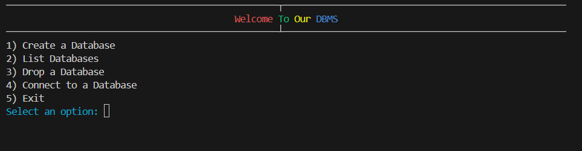
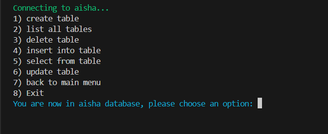
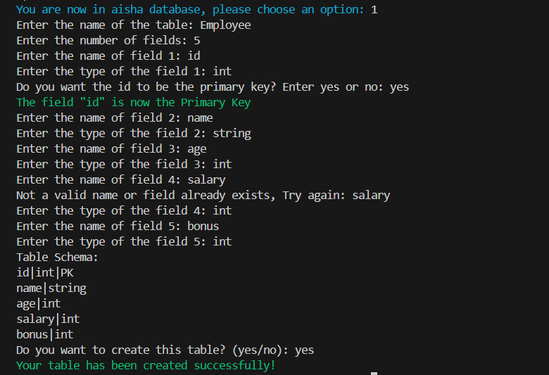
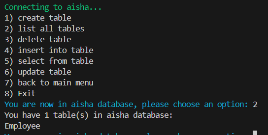
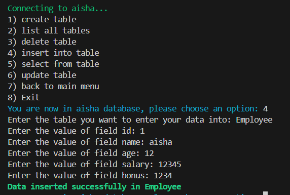
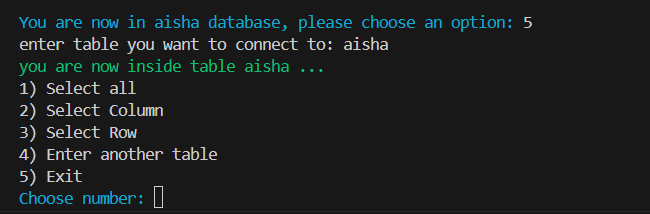
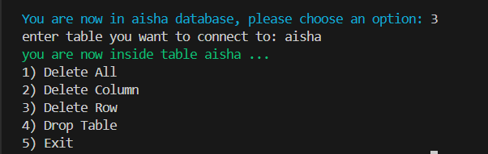

# Database Management System Using Bash Shell Scripting
The Project aims to develop DBMS CLI Menu based app that will enables users to handle CRUD operations.

# Installation
* Clone the repository:git `clone https://github.com/Asmaa3li/DBMS-Bash.git`
* Run the dbms.sh script `./dbms.sh`

# Main Menu:
* Create Database
* List Databases
* Connect To Databases
* Drop Database
* Exit
  

# Connect To Database Menu:
And upon user Connect to Specific Database, there will be new Screen with this Menu:

### 1- Create a Table
#### Notes:
1. Enter the number of fields.
2. Enter a valid field name.
3. Enter a valid field type.
4. Field names must not be duplicated.
5. If you choose a primary key, you will not be prompted to choose another one. If you do not choose one at all, then the last field will be designated as the default primary key.
6. You will be able to review the table schema before confirming the creation of the table.

  

### 2- List all tables

  

### 3- Insert into a table
#### Notes:
1. Enter valid values for each field.
2. The primary key field must have unique values.
3. The primary key field cannot be NULL.
4. Each field, other than the primary key, can be NULL.
  
  

### 4. Select from table
  * Select all 
  * Select Column 
  * Select Row 
  * Enter another table 
  * Exit

  

### 5. Delete table
  * delete all 
  * delete Column 
  * delete Row 
  * drop table
      
  

### 6- Update table
### 7- Back to main menu
### 8- Exit
